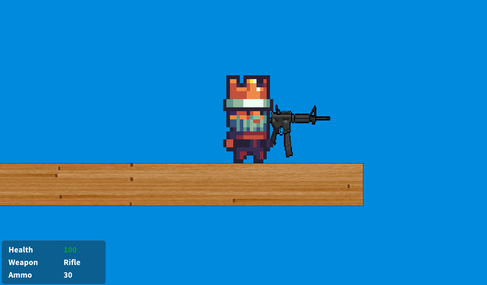
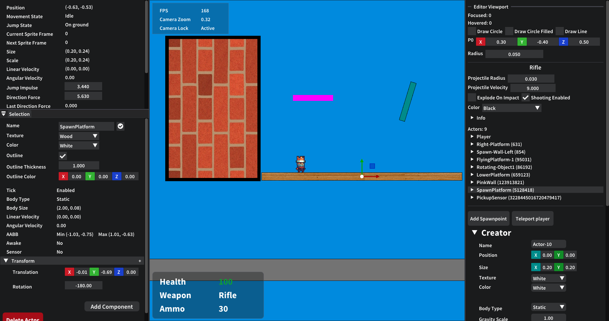

# platformer2d

A 2D game with an editor written in C++.
<br>
<br>
I wanted to focus on learning more about rendering, physics simulation and CMake
and thus this project was born.

---

* [Development](DEVELOPMENT.md)

## Showcase






### Source

 * application ([header](src/core/application.h)/[source](src/core/application.cpp))
 * renderer ([header](src/renderer/renderer.h)/[source](src/renderer/renderer.cpp))
 * editor ([header](src/game/editor.h)/[source](src/game/editor.cpp))
 * actor ([header](src/scene/actor.h)/[source](src/scene/actor.cpp))
 * player ([header](src/game/player.h)/[source](src/game/player.cpp))

## Completed
:white_check_mark: Renderer  
:white_check_mark: Input  
:white_check_mark: Physics  
:white_check_mark: Game Editor  
:white_check_mark: Component System  
:white_check_mark: Serialization  

## Todo
:black_square_button: Documented setup steps<br>
:black_square_button: github actions pipeline<br>
:black_square_button: I do NOT LIKE!!!!! the vcpkg dependency, might remove that (on hold for now)<br>
:black_square_button: Projectile collision (for player weapon :boom:)<br>
:black_square_button: Movable enemies<br>
:black_square_button: Behaviour trees<br>
:black_square_button: Network replication (?)<br>
:black_square_button: Font rendering<br>
:black_square_button: tracy as dependency<br>
:black_square_button: Fix ANNOYING!!! auto include with CMake extension in Visual Studio<br>

<br>

## Setup
Clone the repo and setup all submodules.  
```
git clone --recursive https://github.com/lukkelele/platformer2d
```
Make sure to run `git submodule update --init --recursive` if the repo is cloned **without** the `--recursive` flag.

### Dependencies
The game is dependent on several external libraries.  
Most dependencies are submodules but some need manual installation.

#### glad
The files for glad need to be generated.  
Use the `build_glad.sh` script in the `scripts` directory or run the generation code.
```
# OpenGL 4.6
python -m pip install glad --break-system-packages
python -m glad --profile=core --api=gl=4.6 --generator=c --out-path=modules/glad
```
